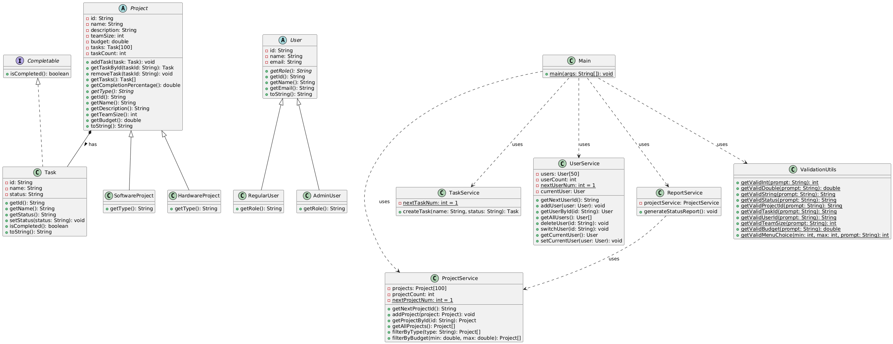

# task management system

## Setup and Run Instructions
1. Install JDK 21 and IntelliJ IDEA.
2. Clone the repository.
3. Open in IntelliJ, build the project.
4. Run Main.java.

## Feature Summary
- Manage projects (add, view, filter by type/budget).
- Manage tasks per project (add, update status, delete).
- User management (add, delete, switch, roles: Regular/Admin).
- Status reports with completion percentages.
- Input validation and error handling.

## OOP Design
- Abstract classes: Project, User.
- Interfaces: Completable.
- Inheritance and polymorphism for project/user types.
- Encapsulation with private fields.

## Class Diagram

The diagram shows the relationships between Main, Services, and Models in the system.

For testing, use the sample data or add new entries via menus.